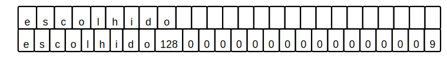
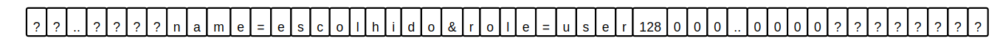
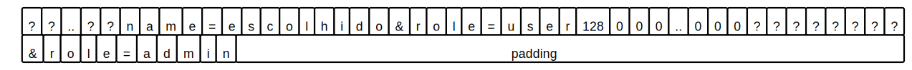
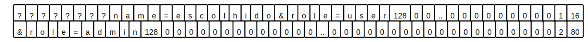

# Length extension attack

When playing around with authentication I noticed that the session store was authenticating sessions with HMAC (Hash-based Messaged Authentication Code). HMAC authenticates a message M by using a secret S and a hash function H to produce a MAC. The message and MAC (M, MAC) are sent together to the client.

This way, when the client sends back the session and its MAC (M', MAC') to authenticate himself, the server can verify that the session content was not modified by a malicious user. The server does this by producing a new MAC with the secret S and the received message M'. If the newly generated MAC matches the received one, we know that M = M' and thus the message was not modified. Note that since the client does not know the secret S, even if he modifies the message, he is unable to produce a MAC' that would match the one generated by the server.

What draw my attention to HMAC was the sole fact that it relies on a hash function. I was questioning myself, if we already have a hash function, why can't we simply H(S || M) to produce the MAC? What kind of vector attacks do we get exposed to if we do this and how does HMAC cover for that?

> || stands for concatenation

## Length extension attack

One of the vulnerabilities we would get exposed to by producing a MAC with H(S || M) would be the Length Extension Attack. Based on a hash H(M1) and the length of M1, this attack allows to compute a valid hash for M1 || M2, where M2 is a message produced by us.

Notice that we need only the length of M1, not its contents. Thus, if we consider the previous scenario where M1 = S || M, this means an attacker can extend the original message and compute a valid hash for that extended message without ever knowing the secret, just the length of S || M. Since the client knows M and its length, only the length of S remains unknown.

With this attack, we would be able to produce valid messages against servers that use H(S || M) as a MAC. All hash functions that are based on the Merkle-Damgard construction (md5, SHA-1, SHA-2) are vulnerable to this. SHA-3, which is based on a Keccac sponge, is not vulnerable to this.

## Merkle-Damgard construction - what the heck?

The Merkdle-Damgard construction is used to derive collision-free hash functions from collision-free one-way compressions functions. A compression function takes an input A of size N and an input B of size M to produce an output of size M.

The derived hash function starts with an internal state of size M and takes an input of variable size that is broken into multiple blocks of size N. The original input, however, may have a size that is not a multiple of N. It is thus necessary to pad the input to make it fit a block of size N.

The padding is formed by the byte 0x80 that separates the message from the remaining padding; It is followed by as many zeroes as necessary (possibily none) to fill the block until only 8 bytes remain available. These 8 last bytes are used to represent the size of the message in bits. Thus, the minimum amount of bytes for padding is 9 bytes.



> 128 is the integer representation of 0x80

> Nope, not going through the trouble of making every square the same size. It's annoying, but we can live with it. At least I can. Moving on ...

If we are working with blocks of 64 bytes, as in the case of SHA-256, and the message has 56 bytes that leaves us only with 8 available bytes for the padding. To overcome this we add an entire new block.

The padding is always added, even if the input is a multiple of N. This is because it also acts as a strengthening factor

1. by separating the message from the padding with the byte 0x80, avoiding messages that naturally end with zeroes from having similar blocks as messages that are shorter and have the same zeroes because of the padding.
2. by appending the size of the message to the last block.

The compression function is continuosly applied to each block of size N and the internal state of size M, resulting in a new internal state at each step. When there are no more input blocks, the hash function outputs its internal state as a the hash digest.

The key idea behind the Length Extension Attack is that the output of the hash function corresponds to its internal state when it finishes processing the input. If we recreate the hash function with the digest it outputs, we can resume the hashing and provide it extra input to produce a MAC for our extended message.

## Yeah, sure! I'm totally following you...

Lets extend some inputs to see it in practice. We'll consider SHA-256 as the hash function.

Imagine the server gave you the following pair (M, MAC) as your session and its MAC:

```javascript
M = "name=escolhido&role=user"
MAC = "c0dff1c2c4540ea52f7ac9df0ae67eb1e5a2b41542b68ab46861a18f85167806"
```

Now it would be nice if we could convince the server that we are not just another mundane user but actually an admin. We know that we can create a new extended message and use the Length Extension Attack to produce a valid MAC for it so maybe we can extend it with `E = &role=admin` and send something like `name=escolhido&role=user&role=admin` to the server.

### What we know about our data

Before trying to resume the SHA-256 hash function, lets take a look at what we have.

1. The server produced the MAC by hashing the input `S || "name=escolhido&role=user"`.

2. SHA-256 processes blocks of 64 bytes and we know that the original input was padded to fit a block. Given that our message is small, we might be tempted to believe it fits in a single block, but that actually depends on the secret's length. Since drawing multiple blocks takes more effort, lets assume our secret is small enough that we can fit both the input and the padding in one block. Anyway, there are three things we don't know about the input processed by SHA-256: 
    1) the secret
    2) the number of zeroes since it depend on secret's length and 
    3) the message's length since it also depends on the secret's length.



3. Finally, we have the resulting MAC from processing this. We know that the resulting digest from a merkle-damgard based hash function corresponds to its final internal state. We will use this digest to recreate the SHA-256 internal state after finishing processing the above block.

Note that we are resuming to an internal state where the block above was already processed, meaning that we don't need to know the secret to produce the new MAC.

### Resuming SHA-256

If we add our extension E, we end up with an input composed of two blocks. When we resume computation of the SHA-256 we will use only the second block as the first was already processed but do notice that we got stuck with the padding between the orignal message and the extension. IT IS PART OF OUR INPUT NOW. The padding was used to compute the original MAC so we can't skip it. We gotta live with that.



The only thing missing is the secret's length. That's quite simple though, we brute force it. Lets start by imagining its size is 10 bytes.



We now have all the missing pieces:
1) We still don't the secret but we the entire purpose of this attack is to do stuff without it. It would be a bummer to discover it at this point.
2) The number of zeroes needed to pad the 64-bytes blocks
3) The original message size (34 bytes) as well as the extended message size with padding included (75 bytes).

```
How do you go from 75 to [0,0,0,0,0,0,2,80]? 
Considering 75 is an unsigned 64 bits integer, you have to convert the integer into an array of 8 bytes.

By the way, Elixir is awesome to deal with binary.
iex> <<75::64-integer>>
<<0,0,0,0,0,0,2,80>>
```

That's it. We just resume SHA-256 and it will compress the second block and its internal state, resulting in a new internal state that is our well deserved MAC. What about the input. Didn't we discover that we had to live with the padding in the input?


```javascript
tampered_M = name=escolhido&role=user\x80\0\0\0\0\0\0\0\0\0\0\0\0\0\0\0\0\0\0\0\0\0\0\0\0\0\0\0\0\0\0\0\0\0\0\0\0\x01\x10&role=admin
tampered_MAC = bbd0bdfc3a2a6291d34d31dfc2bba40965d4b864ed9638d5926c90ec058ba667
```

There it is. Padding included. 

> Wait wait, how exactly do you resume the internal state of a SHA-256 engine? 
> No magic here, just set the initial value for the internal state and tell it how many input bytes were already processed. Take a look at the [code](https://github.com/marcelo140/hashes/blob/08e51a3a07fae5f48a74db3fab7e49b2acc45169/sha2/src/sha256.rs#L101), not that interesting right?

# How HMAC avoids the length extension attack

Back to where it all started. Why can't we use H(S || M) instead of HMAC? Because of vulnerabilities like the Length Extension Attack. How does HMAC avoid the attack then? The RFC for HMAC tells us the following

```
ipad = the byte 0x36 repeated B times
opad = the byte 0x5C repeated B times.

To compute HMAC over the data `text' we perform
    H(K XOR opad, H(K XOR ipad, text))
```

The B they talk about stands for block size but lets ignore the padding stuff to keep it simpler and see what we get.
```
To compute HMAC over the data `text' we perform
    H(K, H(K, text))
```

HMAC rehashes the digest that we use as the internal state to extend the message. Since we don't know it, we can no longer use it to process additional input. But what about trying to extend the digest that resulted from the rehash? There's no much to gain that. We would be trying to extend an internal state that has a fixed block size anyway. 

That's a quite simple solution to the problem.

> It would be pretty nice to understand how the Keccac Sponge avoids this. But not now... I'm tired.

